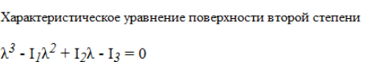

# Домашняя работа

1. Читаем материал лекци;

2. Читаем информационные ресурсы:
 * [веб цвета](http://htmlbook.ru/samhtml/znacheniya-atributov-tegov/tsvet)
 * [веб размерности](http://htmlbook.ru/samhtml/znacheniya-atributov-tegov/razmer)
 * [работа с текстом](http://htmlbook.ru/samhtml/tekst)
 * [блочные элементы](http://htmlbook.ru/samhtml/tipy-tegov/blochnye-elementy)
 * [строчные элементы](http://htmlbook.ru/samhtml/tipy-tegov/strochnye-elementy)
 * [парные и непарные теги](http://ibrain.kz/sozdanie-web-saytov/parnye-i-odinochnye-tegi-konteynery)

3. Практика(тренируемся в использовании тегов и атрибутов):
 * Сверстать заголовки: 
 * 
 * Сверстать формулу:   
 * 
 * Подсказка: http://htmlbook.ru/samhtml/tekst/verkhniy-i-nizhniy-indeks
 * Сверстать макет: 

