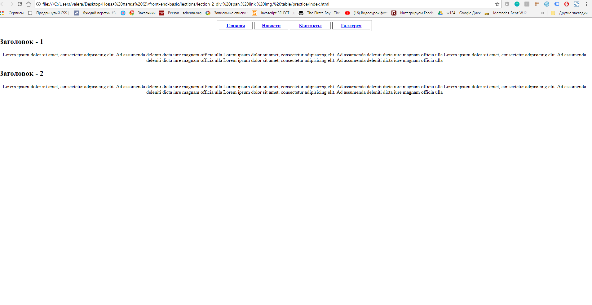
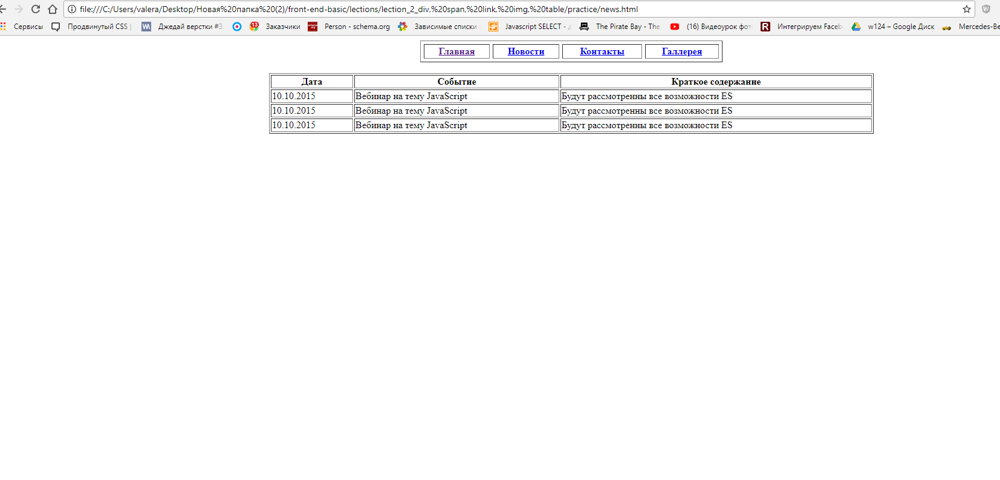
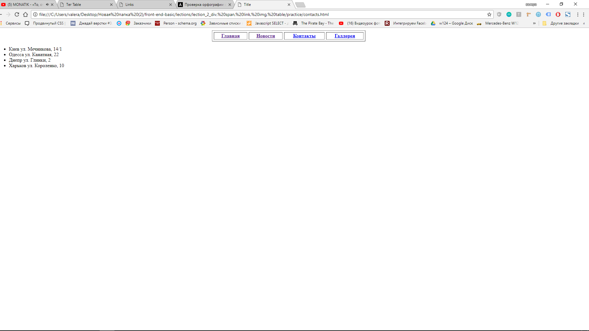
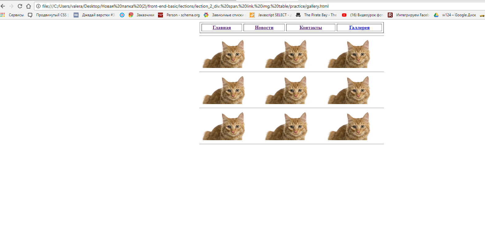

# Домашняя работа

## 1)Доделать то что не успели на уроке.

 ### Главная страница:
  
 ### Cтраница новостей:
 
 ### Cтраница контактов:
 
 ### Cтраница галерея:
 

## 2)Повторяем:
  * Форматирование HTML:https://webref.ru/course/html-basics/formatting
  * Cемантика:https://webref.ru/course/html-basics/semantics
  * Еще про блочные + строчные: https://webref.ru/course/html-basics/block-inline

## 3)Повторить материал последних двух лекций.

