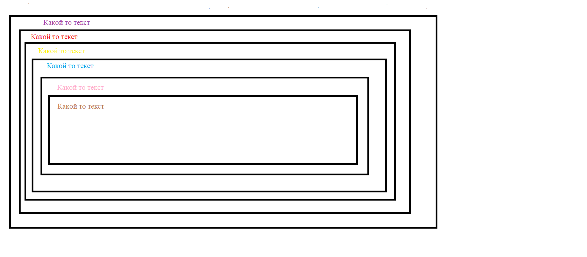

# Практическая работа

* Cоздать 6 вложенные друг в друга тега div. Каждые тег div должен содержать какой то текст. 1-3тим тегам div даем классы (название на ваше усмотрение), 3-6 тегу div не даем классов. 
Изменить каждому div-у ширину\высоту (размерность на ваше усмотрение) и цвет текста. На отступы, бордеры не обращаем внимание.

Схематично рассположение элементов друг в друге: 

