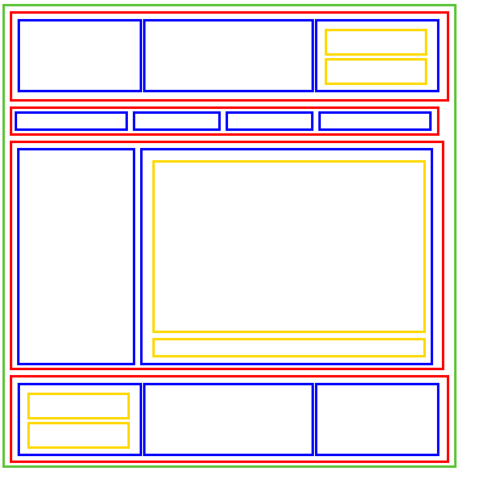

# Домашняя работа

1. Читаем материал лекци;

2. Читаем информационные ресурсы:
 * https://html5book.ru/block-inline-elements/#part7 
 * https://learn.javascript.ru/margin --  о margin
 * https://learn.javascript.ru/height-percent  -- о высоте блока
 * http://codeharmony.ru/materials/42 -- оставляем себе как шпоргалку

3. Практика:
 * Верстаем:  

