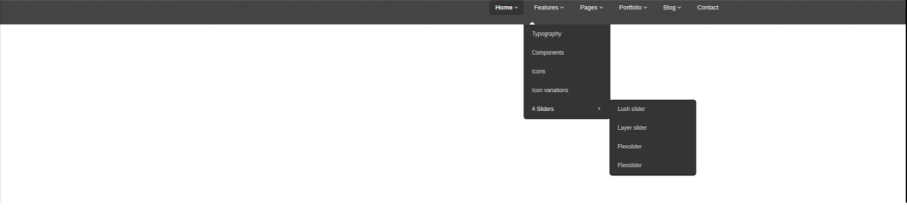

# Домашняя работа

1)Повторяем материал лекции

2)Читаем информационные ресурсы:
 * https://webref.ru/css/z-index
 * https://html5book.ru/css3-transition/ 
 * https://learn.javascript.ru/position
 * https://developer.mozilla.org/en-US/docs/Web/CSS/CSS_animated_properties -- шпаргалка, перечень свойств которые можно анимировать

3)Верстаем макет. Выравниваем элементы по горизонтали при помощи float(еще практикуемся в исп-нии).

  * стрелочки на кнопках делаем через псевдоэлементы
  * добавляем анимацию "первой выпадайки" которая плавно выезжает из под главного меню.
  * добавляем анимацию "2рой выпадайки" которая просто плавно появляется.
