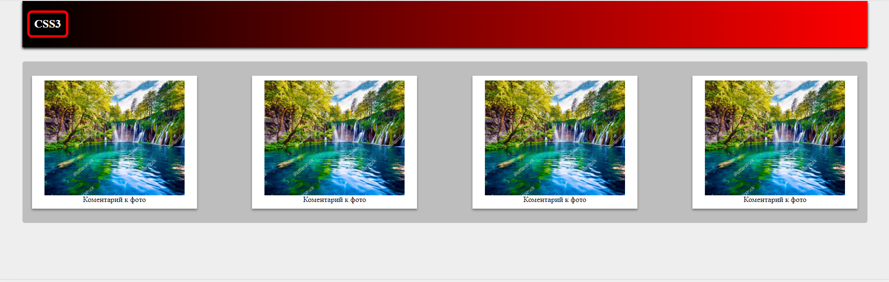
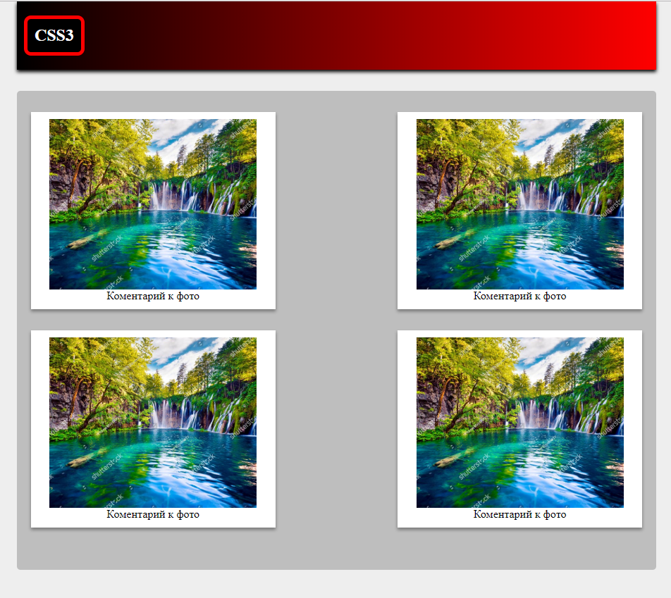
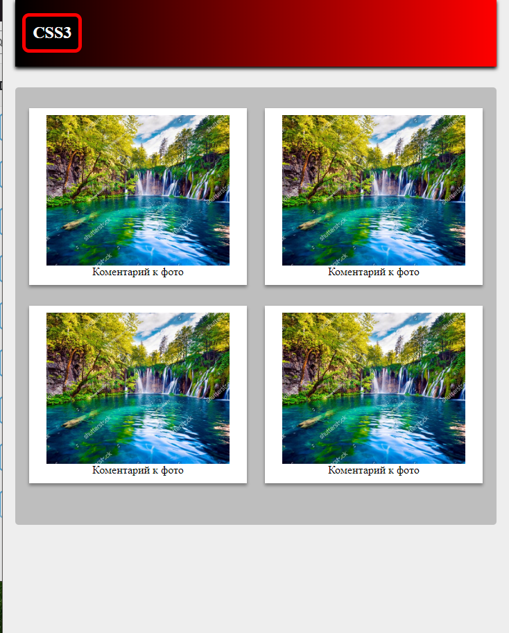
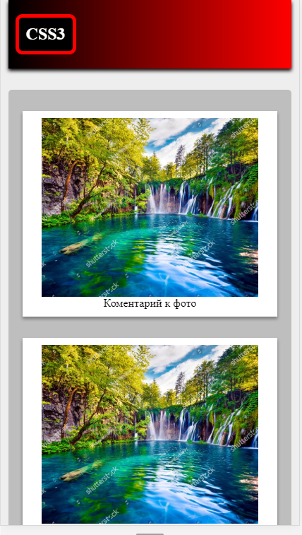
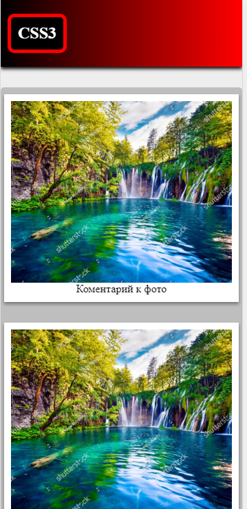

# Практическая работа

* Верстаем макет по скриншотам, испльзуем flexbox + html5 теги + сss3 .
* https://html5.by/blog/flexbox/ -- отличные стенды для демонстрации flexbox (обратите внимание на свойство flex-wrap поможет в ДЗ)

1. PC:

 * 

2. SMALL-PC:

 * 

3. Tablet:

 * 

4. Mobile:

 * 

5. SMALL-Mobile:

 * 